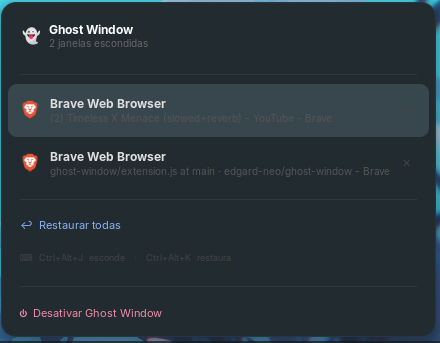

# 👻 Ghost Window

> A GNOME Shell extension that hides any window from Alt+Tab, the Overview, and the Dash with a single keyboard shortcut — keeping the process running silently in the background.

<p align="center">
  
  
  
  
  
</p>

---

## ✨ What it does

Like the old MSN Messenger or Discord — the window disappears from everything (Alt+Tab, Overview, Dock) but the **process keeps running**. Audio, video, downloads — all continue normally. You bring it back whenever you want via the 👻 panel icon or a keyboard shortcut.

**Perfect for:**

- YouTube / Spotify playing in the background without cluttering Alt+Tab
- Long downloads or builds you don't want to see
- Any app you want running silently

---

## 📸 How it looks



---

## 🚀 Installation

### Requirements

- GNOME Shell 45, 46, or 47
- Works on **Wayland** and **X11**
- Tested on: **Zorin OS 17**, Ubuntu 22.04+, Fedora 39+

### Install via script

```bash
# 1. Clone the repository
git clone https://github.com/edgard-neo/ghost-window.git
cd ghost-window

# 2. Run the installer
chmod +x install.sh
./install.sh

# 3. Reload GNOME Shell
#    On X11:     Press Alt+F2, type 'r', press Enter
#    On Wayland: Log out and log back in

# 4. Enable the extension
gnome-extensions enable ghost-window@ghostwindow.local

# 5. restart
gnome-session-quit --logout --no-prompt

```

---

## ⌨️ Default Shortcuts

| Shortcut         | Action                  |
| ---------------- | ----------------------- |
| `Ctrl + Alt + J` | Hide the focused window |
| `Ctrl + Alt + K` | Open the restore menu   |
| Click on 👻      | Open the restore menu   |

> **Customize shortcuts:** `gnome-extensions prefs ghost-window@ghostwindow.local`

---

## 🎯 Daily Usage

```
1. Open Chrome with YouTube playing
2. Press Ctrl+Alt+J
   → Chrome disappears from Alt+Tab and Overview
   → Audio/video keeps playing normally
   → Badge on 👻 shows number of hidden windows

3. To restore:
   → Click 👻 in the top panel
   → Or press Ctrl+Alt+K
   → Click the app name to restore it

4. To disable:
   → Click 👻 → "⏻ Disable Ghost Window"
```

---

## 🔧 How it works

Ghost Window uses two mechanisms to make windows truly invisible:

**1. `window.minimize()`**
Minimizes the window so it disappears from the screen. Unlike `skip_taskbar` (which is read-only on Wayland), `minimize()` works reliably on both Wayland and X11.

**2. `global.display.get_tab_list` patch**
GNOME Shell calls this function to build the Alt+Tab switcher list. Ghost Window overrides it to filter out hidden windows so they never appear in the switcher.

```
Ctrl+Alt+J pressed
      │
      ▼
focus_window.minimize()       ← hides from screen
      │
      ▼
get_tab_list() filtered       ← hides from Alt+Tab
      │
      ▼
window stored in _hidden[]    ← tracked for restore
      │
      ▼
👻 badge updated              ← visual feedback
```

On **disable**, all windows are automatically restored and `get_tab_list` is unpatched back to its original implementation.

---

## 📁 Project Structure

```
ghost-window@ghostwindow.local/
│
├── extension.js        ← Main logic (GJS / ESM modules)
│   ├── GhostIndicator  ← Panel icon + dropdown menu
│   └── GhostWindow     ← Extension lifecycle + window management
│
├── prefs.js            ← Preferences UI (Adwaita / GTK4)
│
├── metadata.json       ← Extension manifest
│
├── install.sh          ← Automated installer script
│
└── schemas/
    └── *.gschema.xml   ← GSettings schema (keyboard shortcuts)
```

---

## 🐛 Troubleshooting

### Extension state is INACTIVE after enable

On **Wayland**, a full logout/login is required after installing or updating — `disable/enable` alone does not reload the JS runtime.

```bash
gnome-session-quit --logout --no-prompt
```

### Shortcut not working

```bash
# Check for JS errors
journalctl -b -o cat /usr/bin/gnome-shell 2>/dev/null | grep -i ghost

# Verify the shortcut value in GSettings
gsettings --schemadir \
  ~/.local/share/gnome-shell/extensions/ghost-window@ghostwindow.local/schemas \
  get org.gnome.shell.extensions.ghost-window hide-shortcut
# Expected: ['<Control><Alt>j']
```

### Window still shows in Alt+Tab

Make sure you did a full **logout and login** after the last install. The `get_tab_list` patch only takes effect after a fresh GNOME Shell session.

### Check live logs while testing

```bash
journalctl -f -o cat /usr/bin/gnome-shell 2>/dev/null | grep GhostWindow
```

---

## 🤝 Contributing

Contributions are very welcome!

```bash
# Clone and install locally
git clone https://github.com/edgard-neo/ghost-window.git
cd ghost-window
./install.sh

# Watch logs while developing
journalctl -f -o cat /usr/bin/gnome-shell 2>/dev/null | grep GhostWindow

# After changes on Wayland: logout + login
# After changes on X11: Alt+F2 → 'r' → Enter
```

---

## 📋 Known Limitations

| Limitation                                      | Status                        |
| ----------------------------------------------- | ----------------------------- |
| Wayland requires logout/login after install     | By design (GNOME limitation)  |
| Windows may still appear in Overview thumbnails | Planned fix                   |
| Notifications from hidden apps still appear     | Expected (process is running) |

---

## 📜 License

Licensed under the **GNU General Public License v3.0** — see [LICENSE](LICENSE).

---
