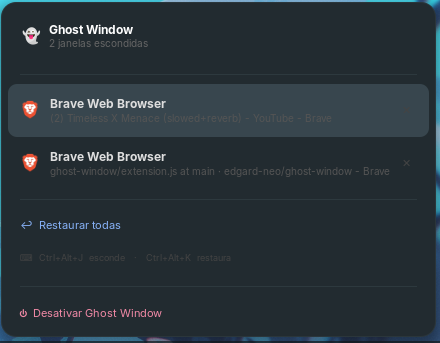

<p align="right">
  <a href="README.md">🇺🇸 English</a> &nbsp;|&nbsp;
  <a href="README.pt-br.md">🇧🇷 Português</a>
</p>

# 👻 Ghost Window

> **A GNOME extension that makes any window disappear — without closing it.**

<p align="center">
  
  
  
  
  
</p>

---

## 💡 The Problem It Solves

You're playing music on YouTube, downloading a large file, or running a long build — but the window keeps cluttering your Alt+Tab and workspace.

You don't want to close it. You just don't want to see it.

**Ghost Window solves exactly that.**

---

## ✨ What It Does

Press a shortcut → the window vanishes from your screen, Alt+Tab, and Dock.

The app **keeps running normally in the background** — audio plays, downloads continue, processes keep going. You bring it back anytime with one click or shortcut.

Think of it like putting a window in "stealth mode."



---

## 🎯 Real-World Use Cases

| Situation                      | What you do                         |
| ------------------------------ | ----------------------------------- |
| YouTube playing while you work | Hide the browser, audio keeps going |
| Long download or build running | Hide the terminal, it keeps running |
| App you need later but not now | Hide it, restore in one click       |

---

## 🚀 How to Install

**Requirements:** Linux with GNOME Shell 45, 46, or 47 (Ubuntu, Fedora, Zorin OS, etc.)

```bash
# 1. Download the project
git clone https://github.com/edgard-neo/ghost-window.git
cd ghost-window

# 2. Run the installer
chmod +x install.sh
./install.sh

# 3. Log out and log back in (required on Wayland)
gnome-session-quit --logout --no-prompt

# 4. Enable the extension
gnome-extensions enable ghost-window@ghostwindow.local
```

---

## ⌨️ Shortcuts

| Shortcut         | What it does            |
| ---------------- | ----------------------- |
| `Ctrl + Alt + J` | Hide the current window |
| `Ctrl + Alt + K` | Open the restore menu   |
| Click on 👻      | Open the restore menu   |

> Want different shortcuts? Run: `gnome-extensions prefs ghost-window@ghostwindow.local`

---

## 🔄 Daily Workflow

```
1. Open Chrome with YouTube
2. Press Ctrl+Alt+J
   → Chrome disappears from Alt+Tab and Overview
   → Music keeps playing

3. To get it back:
   → Click 👻 in the top bar
   → Or press Ctrl+Alt+K
   → Click the app name

4. To turn off Ghost Window entirely:
   → Click 👻 → "⏻ Disable Ghost Window"
   → All hidden windows come back automatically
```

---

## 🔧 Under the Hood

> _For developers and the curious — skip this if you just want to use it._

Ghost Window uses two browser hooks from GNOME Shell's JavaScript API:

- **`window.minimize()`** — hides the window from the screen (works on both Wayland and X11)
- **`get_tab_list()` override** — intercepts GNOME's Alt+Tab builder and filters out hidden windows before they appear

When the extension is disabled, both hooks are removed and all windows are fully restored.

---

## 🐛 Common Issues

**Extension shows as INACTIVE after install**
→ You need to log out and log back in. On Wayland, the shell doesn't hot-reload.

**Shortcut not working**

```bash
journalctl -b -o cat /usr/bin/gnome-shell 2>/dev/null | grep -i ghost
```

**Window still shows in Alt+Tab**
→ Do a full logout + login after installing. The Alt+Tab patch only activates on a fresh session.

---

## 📋 Known Limitations

| Limitation                                      | Status                              |
| ----------------------------------------------- | ----------------------------------- |
| Wayland requires logout after install           | By design (GNOME limitation)        |
| Windows may still appear in Overview thumbnails | Planned fix                         |
| Notifications from hidden apps still show       | Expected — the app is still running |

---

## 🤝 Contributing

```bash
git clone https://github.com/edgard-neo/ghost-window.git
cd ghost-window
./install.sh

# Watch live logs while developing
journalctl -f -o cat /usr/bin/gnome-shell 2>/dev/null | grep GhostWindow

# After changes on Wayland: logout + login
# After changes on X11: Alt+F2 → type 'r' → Enter
```

---

## 📜 License

GNU General Public License v3.0 — see [LICENSE](LICENSE).
